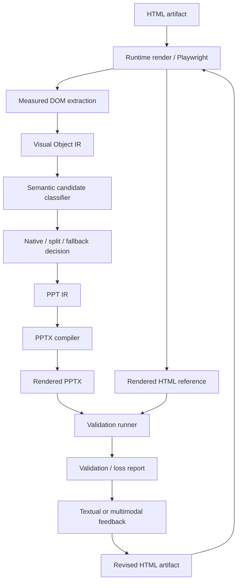
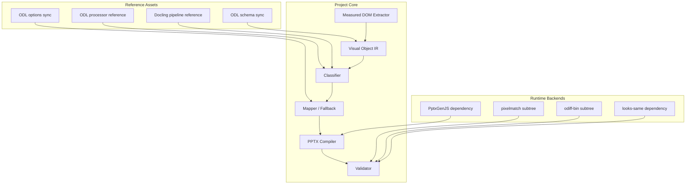

# Architecture v0.2

This version reflects the updated source-of-truth policy:

- HTML artifact is the canonical source
- rendered HTML is the visual reference
- PPTX is the evaluation surface
- multimodal feedback is a correction layer for revised HTML generation

## 1. High-level mechanism

## 2. Layered module design

## 3. Third-party integration architecture

## 4. Design authority

The architecture should also include a design authority layer, even if implemented incrementally.

Its role is to preserve consistency across iterations:

- spacing scale
- typography scale
- radius scale
- color/token policy
- component recipe selection
- fallback style consistency

## 5. Compiler rule

The final PPT compiler must remain deterministic.

Preferred split of responsibilities:

- deterministic compiler -> final PPT objects and package generation
- multimodal layer -> visual critique, localization, and revision suggestions
